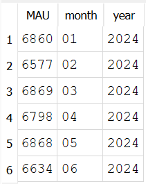
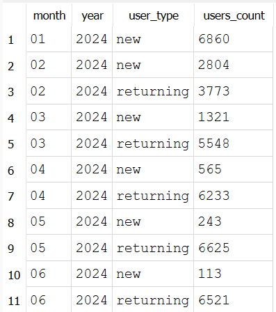
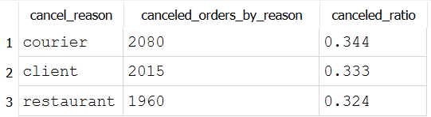
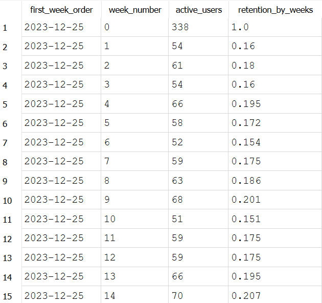
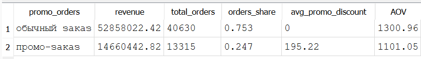

# product-analytics-delivery-sql
# Product Analytics Case: Анализ сервиса доставки (SQL)

## О проекте

Этот проект моделирует работу продуктового аналитика в сервисе доставки еды.  
Цель — проанализировать пользовательскую активность, поведение пользователей и операционные метрики сервиса с помощью SQL.

Анализ проводится на синтетическом датасете, который имитирует реальные данные продукта.

---

## Данные

Датасет включает три основные таблицы:

- **users** — пользователи сервиса  
- **restaurants** — рестораны, подключенные к платформе  
- **orders** — заказы и этапы доставки  

Параметры датасета:

- 12 000 пользователей  
- 120 ресторанов  
- 60 000 заказов  
- 3 города  
- период активности — 6 месяцев  

Данные генерируются с помощью Python-скрипта: scripts/generate_delivery_data.py

---

# Проведённый анализ

---

# 1. Проверка качества данных (Data Quality)

Перед расчетом метрик были выполнены проверки:

- количество строк в таблицах  
- уникальность ключей  
- корректность связей между таблицами  
- распределение статусов заказов  

Цель этапа — убедиться, что данные корректны и пригодны для анализа.

---

# 2. Метрики пользовательской активности

Были рассчитаны базовые метрики активности пользователей:

- **MAU (Monthly Active Users)**  
- **Среднее число заказов на пользователя**
- **New vs Returning Users**

Пример результата:

Наблюдения:

- активная аудитория сервиса остается стабильной на протяжении периода
- большинство пользователей после первого заказа становятся возвращающимися
- не наблюдается сезонности в заказх по месяцам

---

# 3. Анализ воронки заказа

Процесс заказа рассмотрен как продуктовая воронка:

1. created  
2. assigned  
3. picked_up  
4. delivered  

Анализ воронки позволяет определить, на каких этапах теряются заказы.

Цель анализа:

- выявление узких мест в процессе доставки  
- анализ причин отмен заказов
 

---

# 4. Retention-анализ

Пользователи были сгруппированы в когорты по дате первого заказа.

Рассчитаны метрики:

- **D1 retention**
- **D7 retention**
- активность когорт во времени

Цель — оценить удержание пользователей и “липкость” продукта.
 

---

# 5. Метрики монетизации

Для оценки экономики сервиса были рассчитаны:

- **GMV (Gross Merchandise Value)**
- **Average Order Value**
- доля заказов с промо
 
- **ARPU**

Эти метрики позволяют понять структуру выручки и влияние промо-акций на спрос.

---

# 6. Операционные метрики доставки

Также были рассчитаны операционные показатели сервиса:

- среднее время доставки  
- время назначения курьера  
- доля заказов, выполненных в рамках SLA  

Эти метрики помогают оценить качество сервиса и эффективность операционных процессов.

---

# Основные выводы

По результатам анализа можно выделить несколько наблюдений:

- активная аудитория сервиса остается относительно стабильной  
- средняя частота заказов составляет около **1.45 заказов на пользователя в месяц**  
- большинство пользователей после первого заказа продолжают пользоваться сервисом  
- доля отмен заказов невысока и чаще всего происходит до назначения курьера  
- сервис выполняет большую часть доставок в пределах SLA

---

# Используемые инструменты

- **SQL (SQLite)**
- **Python**
- **pandas**
- **DB Browser for SQLite**
- **GitHub**

---

# Как воспроизвести анализ

1. Сгенерировать данные
2. Создать структуру базы
3. Выполнить SQL-запросы из папки `sql/`.

---

# Автор

Ярослава Цапаева  
НИУ ВШЭ — Факультет экономических наук - ОП "Экономика" - Исследовательский поток
